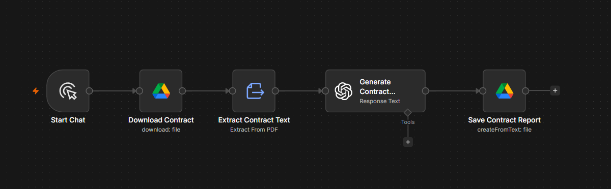

# AI Contract Analyzer

## Overview

The AI Contract Analyzer is an n8n workflow that automatically reviews employment contracts using OpenAI. It extracts important clauses, identifies potential risks, highlights key dates, and generates a structured analysis within seconds.

---

## Problem

Employment contracts are often lengthy and difficult to understand. Important clauses such as notice periods, probation, restrictive covenants, holiday entitlement, and termination conditions can easily be overlooked.

---

## Solution

This workflow automates contract analysis by using AI to identify key information and present it in a clear, structured report.

The generated report includes:

- Overall contract risk assessment
- Important clauses
- Potential concerns
- Key dates
- Recommendations
- Plain English summary

---

## Workflow

1. Upload a contract (PDF or DOCX)
2. Extract document text
3. Send the text to OpenAI
4. Analyse the contract
5. Generate a structured report
6. Save the report to Google Drive

---

## Technology Stack

- n8n
- OpenAI GPT-5
- Google Drive
- Document Processing

---

## Business Value

- Reduces manual contract review time
- Produces consistent analysis
- Helps identify potential legal risks
- Improves productivity
- Creates professional reports automatically

---

## Workflow Screenshot

## Future Improvements

- OCR support for scanned PDFs
- Clause comparison between contracts
- Company policy compliance checks
- Email notifications
