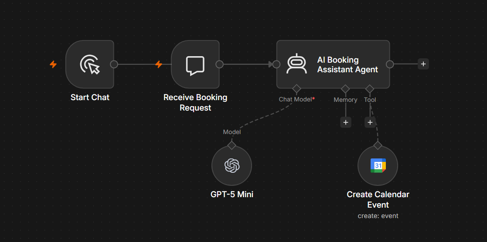

# AI Appointment Booking Assistant

## Overview

The AI Appointment Booking Assistant is an n8n workflow that uses OpenAI and Google Calendar to schedule appointments through natural conversation. It understands booking requests, asks follow-up questions when required, and creates calendar events automatically.

---

## Problem

Scheduling appointments manually often involves multiple emails or messages to confirm dates, times, locations, and attendees. This repetitive process consumes valuable time and increases the risk of double bookings or missing information.

---

## Solution

This workflow acts as an intelligent booking assistant by understanding natural language requests and creating Google Calendar events automatically.

The workflow can:

- Understand natural language booking requests
- Ask for missing information
- Confirm appointment details
- Create Google Calendar events
- Reduce manual scheduling

---

## Business Value

This workflow helps businesses:

- Save time on appointment scheduling
- Reduce administrative workload
- Improve customer experience
- Minimise booking errors
- Automate repetitive calendar management

---

## Technology Stack

- n8n
- OpenAI GPT-5
- AI Agent
- Google Calendar
- Prompt Engineering

---

## Workflow Screenshot

---

## Future Improvements

- Availability checking before booking
- Meeting rescheduling
- Appointment cancellation
- Microsoft Outlook Calendar support
- Email confirmation to attendees
