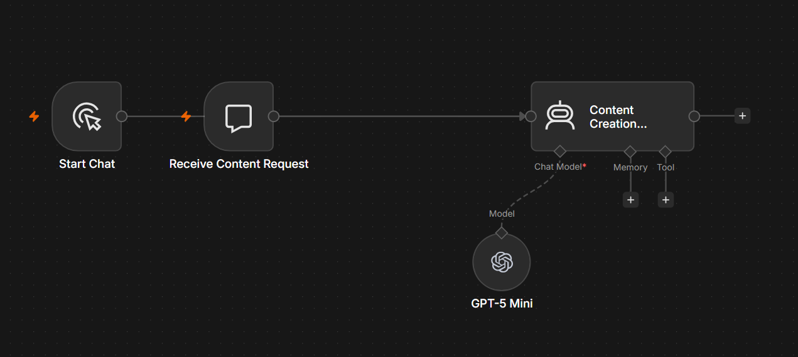

# AI Content Creator

## Overview

The AI Content Creator is an n8n workflow that generates high-quality written content using OpenAI. It assists businesses, marketers, and content creators by producing professional content tailored to different audiences, industries, and communication channels.

---

## Problem

Creating engaging, high-quality content consistently is both time-consuming and resource-intensive. Businesses often need blogs, website copy, newsletters, product descriptions, and marketing materials while maintaining a consistent brand voice.

---

## Solution

This workflow uses AI to generate structured, publication-ready content from a simple user request.

The generated content can include:

- Blog articles
- Website copy
- Product descriptions
- Landing pages
- Marketing copy
- Newsletters
- Press releases
- FAQs
- Business documents

---

## Business Value

This workflow helps businesses:

- Produce content significantly faster
- Reduce content production costs
- Maintain a consistent writing style
- Improve marketing productivity
- Scale content creation with AI assistance

---

## Technology Stack

- n8n
- OpenAI GPT-5
- AI Agent
- Prompt Engineering

---

## Workflow Screenshot

---

## Future Improvements

- Brand voice customisation
- SEO optimisation
- WordPress publishing
- Multi-language content generation
- Content approval workflow
