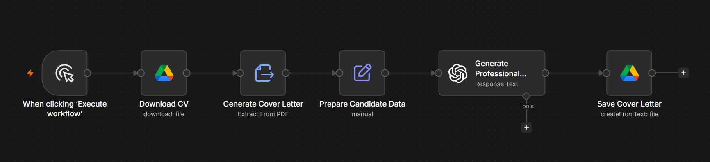

# AI Cover Letter Generator

## Overview

The AI Cover Letter Generator is an n8n workflow that creates personalised, professional cover letters from a candidate's CV using OpenAI. It produces well-structured, ATS-friendly cover letters tailored for UK employers.

---

## Problem

Writing a high-quality cover letter for every job application is time-consuming and often repetitive. Many applicants struggle to present their experience effectively while keeping each application tailored to the role.

---

## Solution

This workflow extracts information from a candidate's CV and generates a polished cover letter using AI.

The generated cover letter includes:

- Professional introduction
- Relevant experience
- Technical and transferable skills
- Motivation for applying
- Strong closing statement
- Professional UK English

---

## Business Value

This workflow helps job seekers:

- Save time when applying for jobs
- Produce consistent, high-quality cover letters
- Improve application quality
- Generate ATS-friendly documents
- Reduce repetitive writing

---

## Technology Stack

- n8n
- OpenAI GPT-5
- Google Drive
- PDF Text Extraction
- Prompt Engineering

---

## Workflow Screenshot

---

## Future Improvements

- Job description matching
- Company-specific customisation
- Multiple writing styles
- Multi-language support
- PDF export
