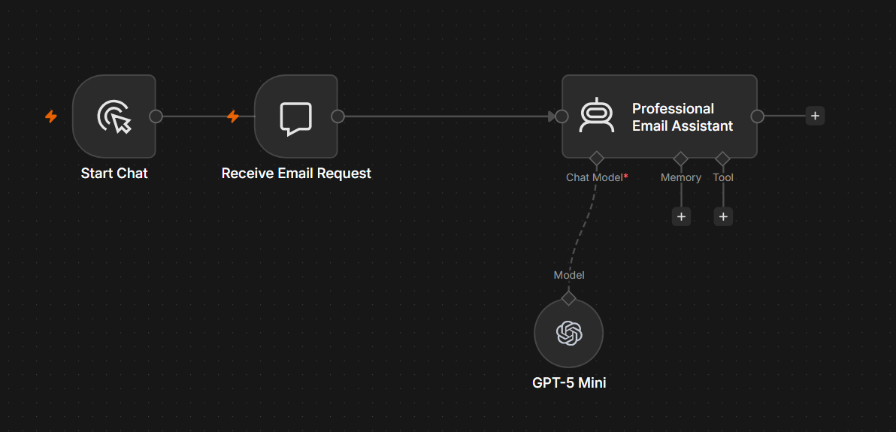

# AI Email Assistant

## Overview

The AI Email Assistant is an n8n workflow that uses OpenAI to generate professional, well-structured emails based on natural language requests. It assists users in writing clear, effective emails for a wide range of business and personal scenarios.

---

## Problem

Writing high-quality emails consistently can be time-consuming, particularly when responding to clients, colleagues, or business enquiries. Poorly written emails can also affect professionalism and communication.

---

## Solution

This workflow uses AI to draft polished emails tailored to the user's intent and preferred tone.

The generated email includes:

- Professional subject line
- Appropriate greeting
- Well-structured email body
- Professional closing
- Signature placeholder
- Grammar and spelling correction

---

## Business Value

This workflow helps businesses:

- Save time writing emails
- Improve communication quality
- Ensure consistent professional writing
- Reduce repetitive administrative tasks
- Increase productivity

---

## Technology Stack

- n8n
- OpenAI GPT-5
- AI Agent
- Prompt Engineering

---

## Workflow Screenshot

---

## Future Improvements

- Tone selection
- Multi-language support
- Email translation
- CRM integration
- One-click Gmail or Outlook sending
