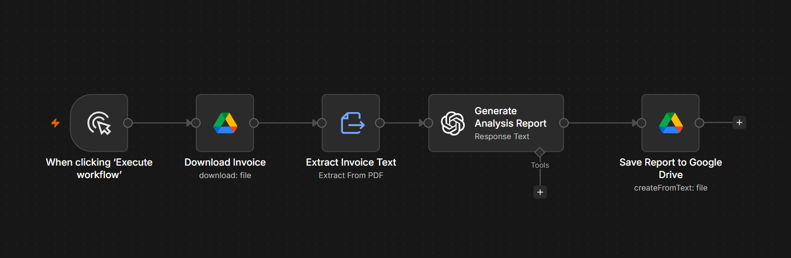

# AI Invoice & Receipt Analyser

## Overview

The AI Invoice & Receipt Analyser is an n8n workflow that automatically extracts and analyses information from invoices and receipts using OpenAI. It converts financial documents into structured reports, helping businesses organise records and review expenses more efficiently.

---

## Problem

Processing invoices and receipts manually is repetitive, time-consuming, and prone to human error. Businesses often spend valuable time extracting totals, suppliers, tax information, and payment details from financial documents.

---

## Solution

This workflow automates invoice and receipt processing by extracting key information and generating a structured financial report.

The generated report includes:

- Executive summary
- Supplier information
- Invoice details
- Financial breakdown
- Spending analysis
- Missing information
- Recommendations

---

## Business Value

This workflow helps businesses:

- Reduce manual data entry
- Improve bookkeeping efficiency
- Standardise financial reporting
- Speed up expense reviews
- Save valuable administrative time

---

## Technology Stack

- n8n
- OpenAI GPT-5
- Google Drive
- PDF Text Extraction
- Prompt Engineering

---

## Workflow Screenshot

---

## Future Improvements

- OCR support for scanned invoices
- Automatic accounting software integration
- Duplicate invoice detection
- Currency conversion
- Financial dashboard reporting
