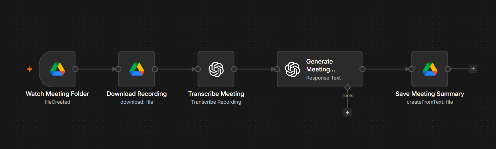

# AI Meeting Summariser

## Overview

The AI Meeting Summariser is an n8n workflow that automatically transcribes meeting recordings using OpenAI and generates professional meeting minutes in a structured format. It captures key discussions, decisions, action items, risks, and next steps, reducing the need for manual note-taking.

---

## Problem

Writing meeting minutes manually is time-consuming and often results in incomplete or inconsistent documentation. Important decisions and action items can easily be missed.

---

## Solution

This workflow automatically downloads a meeting recording, transcribes the audio, analyses the transcript using AI, and produces structured meeting minutes ready to share with stakeholders.

The generated report includes:

- Executive Summary
- Key Discussion Points
- Decisions Made
- Action Items
- Risks & Issues
- Questions Raised
- Next Steps
- Overall Meeting Outcome

---

## Business Value

This workflow helps organisations:

- Eliminate manual note-taking
- Improve meeting documentation
- Increase team accountability
- Save administrative time
- Produce consistent meeting records

---

## Technology Stack

- n8n
- OpenAI GPT-5
- OpenAI Speech-to-Text
- Google Drive
- Prompt Engineering

---

## Workflow Screenshot

---

## Future Improvements

- Speaker identification
- Automatic calendar integration
- Email meeting minutes to attendees
- Multi-language transcription
- Action item reminders
