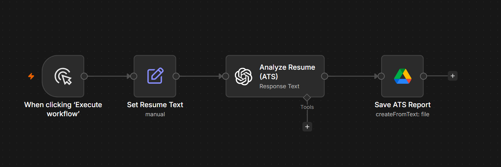

# AI ATS Resume Analyzer

## Overview

The AI ATS Resume Analyzer is an intelligent n8n workflow that evaluates resumes using OpenAI. It analyzes the candidate's experience, technical skills, education, strengths, and areas for improvement, producing a structured report within seconds.

---

## Problem

Recruiters and hiring managers often spend significant time manually reviewing resumes. Important qualifications, missing skills, and potential concerns can easily be overlooked, especially when reviewing large numbers of applicants.

---

## Solution

This workflow automates resume analysis by extracting key information from uploaded resumes and generating a clear, structured evaluation.

The generated report includes:

- Professional summary
- Technical and soft skills
- Work experience overview
- Education summary
- Key strengths
- Areas for improvement
- Overall candidate assessment

---

## Business Value

This workflow helps businesses:

- Reduce manual resume screening time
- Improve consistency during candidate evaluations
- Identify qualified candidates more quickly
- Support recruitment teams with AI-assisted hiring
- Increase productivity during high-volume recruitment

---

## Technology Stack

- n8n
- OpenAI GPT-5
- AI Agents
- OCR / PDF Text Extraction
- Google Drive
- Prompt Engineering

---

## Workflow Screenshot

---

## Future Improvements

- Candidate scoring system
- Job description matching
- ATS compatibility analysis
- Automatic interview recommendations
- Multi-language resume support
