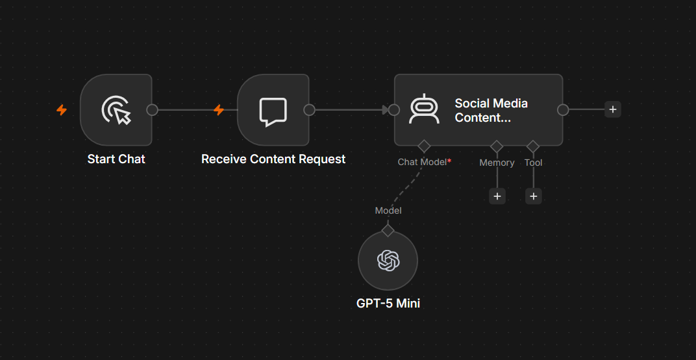

# AI Social Media Content Assistant

## Overview

The AI Social Media Content Assistant is an n8n workflow that generates engaging, platform-specific social media content using OpenAI. It helps businesses create professional posts tailored to platforms such as LinkedIn, Facebook, Instagram, X (Twitter), Threads, and TikTok.

---

## Problem

Creating engaging social media content consistently requires time, creativity, and knowledge of different platforms. Businesses often struggle to maintain a regular posting schedule while adapting content to each audience.

---

## Solution

This workflow uses AI to generate high-quality social media content from a simple prompt or business idea.

The generated content can include:

- Platform-specific captions
- Professional tone of voice
- Suggested hashtags
- Call-to-action
- Alternative caption
- Short and long versions
- Suggested image ideas
- Recommended posting times

---

## Business Value

This workflow helps businesses:

- Produce content faster
- Improve consistency across platforms
- Increase audience engagement
- Reduce content creation costs
- Support marketing teams with AI-powered content generation

---

## Technology Stack

- n8n
- OpenAI GPT-5
- AI Agent
- Prompt Engineering

---

## Workflow Screenshot

---

## Future Improvements

- Direct LinkedIn publishing
- Facebook Page integration
- X (Twitter) publishing
- Content scheduling
- Analytics and engagement reporting
