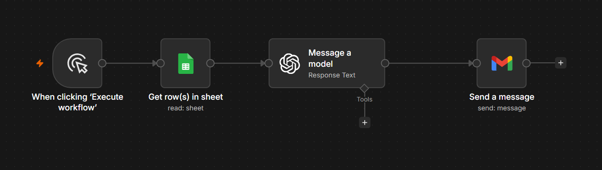

# AI Welcome Email Automation

## Overview

The AI Welcome Email Automation is an n8n workflow that automatically generates and sends personalised welcome emails to new customers using OpenAI, Google Sheets, and Gmail. It helps businesses deliver a consistent onboarding experience while eliminating repetitive manual work.

---

## Problem

Sending personalised welcome emails manually can become time-consuming as customer numbers grow. Inconsistent messaging and delayed responses can negatively affect the customer onboarding experience.

---

## Solution

This workflow automatically retrieves new customer information, generates a personalised welcome email using AI, and sends it through Gmail.

The workflow includes:

- Customer information retrieval
- AI-generated personalised email
- Professional business tone
- Automatic Gmail delivery
- Consistent customer onboarding

---

## Business Value

This workflow helps businesses:

- Automate customer onboarding
- Improve customer experience
- Reduce manual administration
- Ensure consistent communication
- Save valuable operational time

---

## Technology Stack

- n8n
- OpenAI GPT-5
- Google Sheets
- Gmail
- Prompt Engineering

---

## Workflow Screenshot

---

## Future Improvements

- CRM integration
- Multi-language email support
- Follow-up email sequence
- Customer segmentation
- Analytics and delivery tracking
